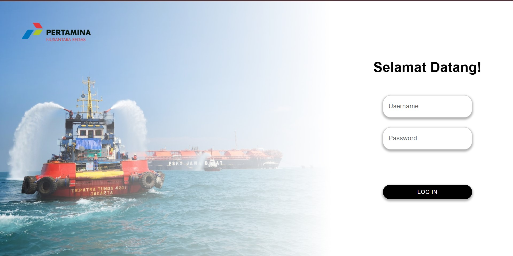
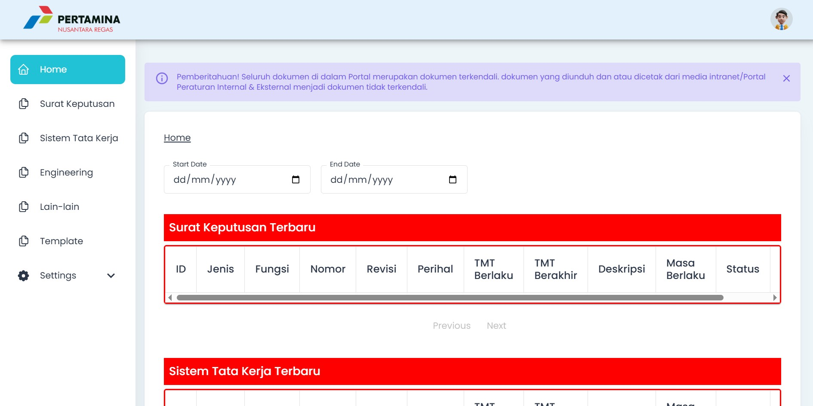

# SEMAR Admin

Welcome to the SEMAR Admin project! This README will guide you through the setup process step-by-step.

## Project Overview

SEMAR is a comprehensive dashboard designed to manage policy documents. It provides a modern, user-friendly interface for document management, policy tracking, and administrative tasks.




## Important Notice

This project was originally developed for internal use. If you plan to use or modify this project for your own purposes, please note:
- Remove or replace any company-specific branding and trademarks
- Update all references to "NR" or "Nusantara Regas" with your own organization's information
- Modify the authentication and authorization system according to your needs
- Update the contact information and support details

## Key Features

- **Document Management System**
  - Upload and organize policy documents
  - Version control and document tracking
  - Secure document storage and access control

- **User Authentication & Authorization**
  - Role-based access control
  - Secure login system
  - User management capabilities

- **Modern UI/UX**
  - Material-UI based responsive design
  - Interactive data visualization
  - Intuitive navigation and search

- **Data Analytics**
  - Document usage statistics
  - Policy compliance tracking
  - Custom reporting capabilities

## Technology Stack

- **Frontend Framework**: Next.js 14.2.3
  - Provides server-side rendering and optimized performance
  - Enables SEO-friendly pages and fast page loads

- **UI Components**: Material-UI 5.14.3
  - Professional-grade components
  - Consistent design language
  - Responsive layouts

- **Authentication**: NextAuth.js
  - Secure authentication system
  - Session management
  - Role-based access control

- **Data Visualization**: ApexCharts
  - Interactive charts and graphs
  - Real-time data updates
  - Customizable visualizations

## Prerequisites

Before you begin, ensure you have the following installed:

- [Node.js](https://nodejs.org/) (version 14.x or higher)
- [npm](https://www.npmjs.com/) (version 6.x or higher)
- [Git](https://git-scm.com/)

## Detailed Setup Instructions

1. **Clone the Repository**

```sh
git clone https://github.com/revanza-git/semar-admin.git
cd semar
```

2. **Install Dependencies**

```sh
npm install
```

3. **Environment Configuration**
   Create a `.env` file in the root directory with the following variables:
   ```
   # Application
   NEXT_PUBLIC_BASEPATH=/portal/semar
   NODE_ENV=development

   # Authentication
   NEXTAUTH_URL=http://localhost:3000
   NEXTAUTH_SECRET=your-secret-key

   # Database
   DATABASE_URL=your-database-connection-string

   # Server
   HOST=localhost
   PORT=3000
   ```

4. **Configure Upload Directories**

```sh
mkdir -p inetpub/data/uploads/semar
mkdir -p inetpub/data/template/semar
```

5. **Database Setup**
   Contact your system administrator for:
   - Database migration scripts
   - Initial data seeding
   - Access credentials

6. **Development Server**

```sh
npm run dev
```
   The application will be available at `http://localhost:3000`

7. **Production Build**

```sh
npm run build
npm start
```

## Project Structure

```
semar/
├── public/          # Static assets
├── src/            # Source code
├── pages/          # Next.js pages
├── types/          # TypeScript definitions
└── inetpub/        # Upload directories
```

## Contributing

We welcome contributions! Please contact me if you want to contribute.

## License

This project is proprietary of Revanza Raytama.

## Contact

For technical support or inquiries:
- Email: [revanza.raytama@gmail.com](mailto:revanza.raytama@gmail.com)
- LinkedIn: [linkedin.com/in/revanzaraytama](https://linkedin.com/in/revanzaraytama)

Thank you for using SEMAR Admin!
